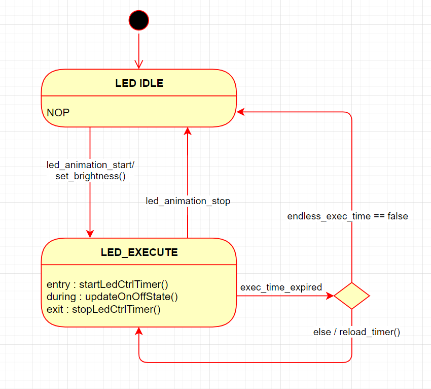

# led-animation-fsm-basic

This project contains a FSM for led basic animations according to basic parameters like period, time on, execution pattern time, and brightness level. 

---

### LED Animation Parameters : 

**Period**  :  Value in ms indicating the LED animation period.
**Time on** :  time within the period where the LED is on. [T_on < Period] 
**brightness** : The led brightness can be adjusted from 0 to 100, where 100 is full bright.


---
### FSM implementation
The FSM is created according to the following State Chart



**Note :** The brightness can be set at any point in the fsm execution 

#### Example 
``` c
/* Example */
led_pwm_t led2 =
    {
        .ch = TIM_CHANNEL_1,
        .tim = &htim2};

led_animation_t breath =
    {
        .brightness = 0,
        .execution_time = LED_ENDLESS_EXEC_TIME,
        .period = 100,
        .time_on = 100};

void led_animation_breath(void)
{
  static uint32_t millis_counter = 0;
  if (HAL_GetTick() - millis_counter > 30)
  {
    millis_counter = HAL_GetTick();

    //-------- Update every 30ms ---------//
    static int fade_amount = 1;
    breath.brightness = (breath.brightness + fade_amount) % (LED_MAX_BRIGHTNESS);

    if (breath.brightness >= (LED_MAX_BRIGHTNESS-1) || (breath.brightness <= 0))
      fade_amount *= -1;

	led_set_brightness(&led_animation, breath.brightness);
  }
}


/**
  * @brief  The application entry point.
  */
int main(void)
{
  /* MCU configuration */
  peripherals_init();
  print_startup_message();

  /* init led fsm*/
  led_animation_init(&led_animation, &led2);

  /* start animation */
  led_animation_start(&led_animation, &breath);

  /* infinite loop */
  while (1)
  {
    led_animation_run(&led_animation);
    led_breath_refresh();
  }
}
```